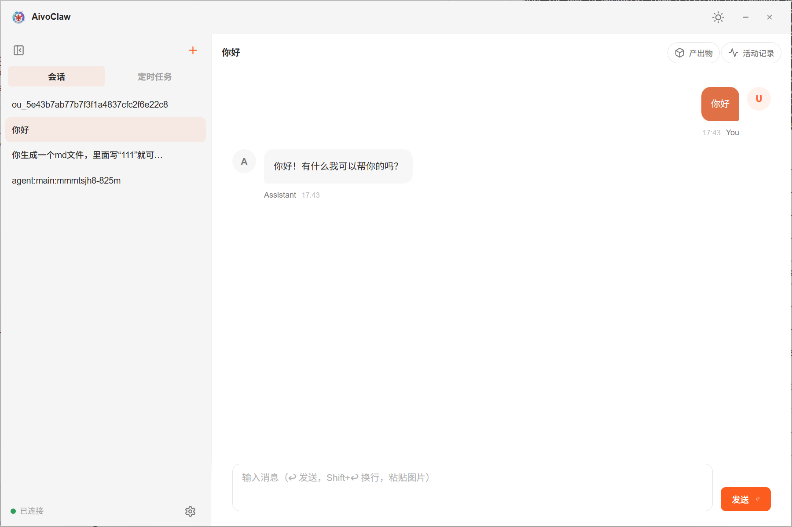
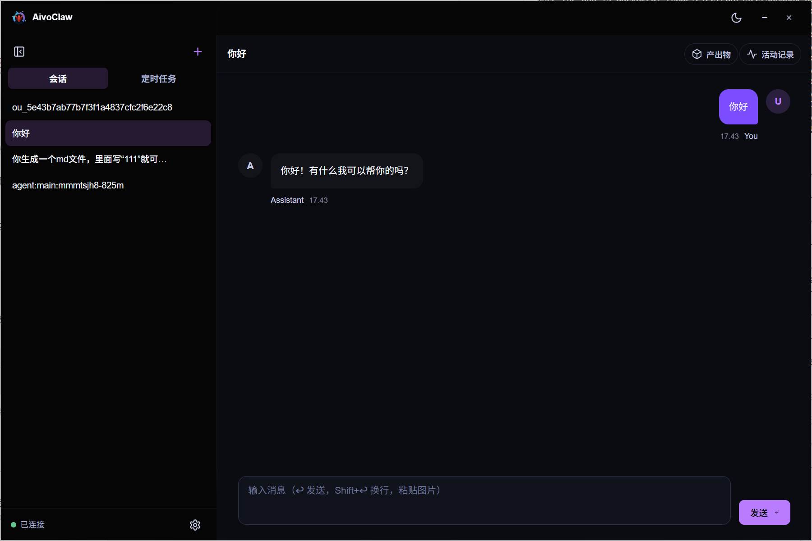
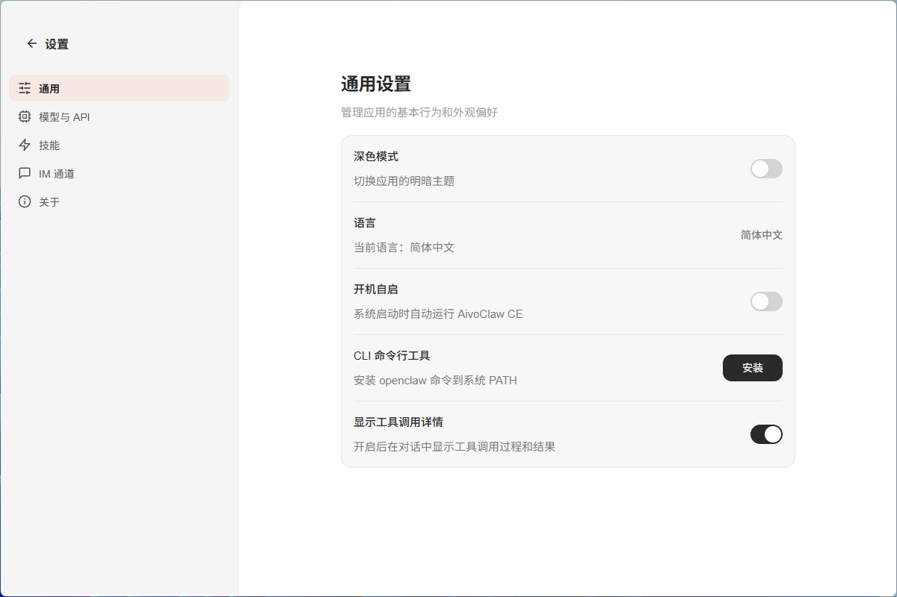
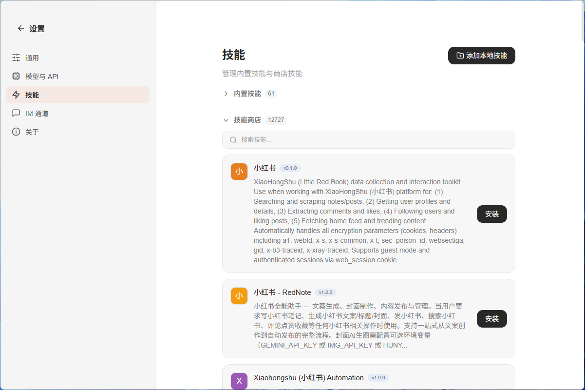
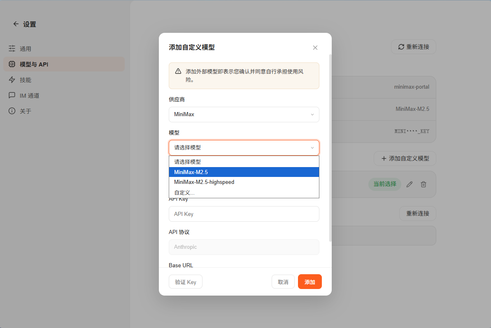
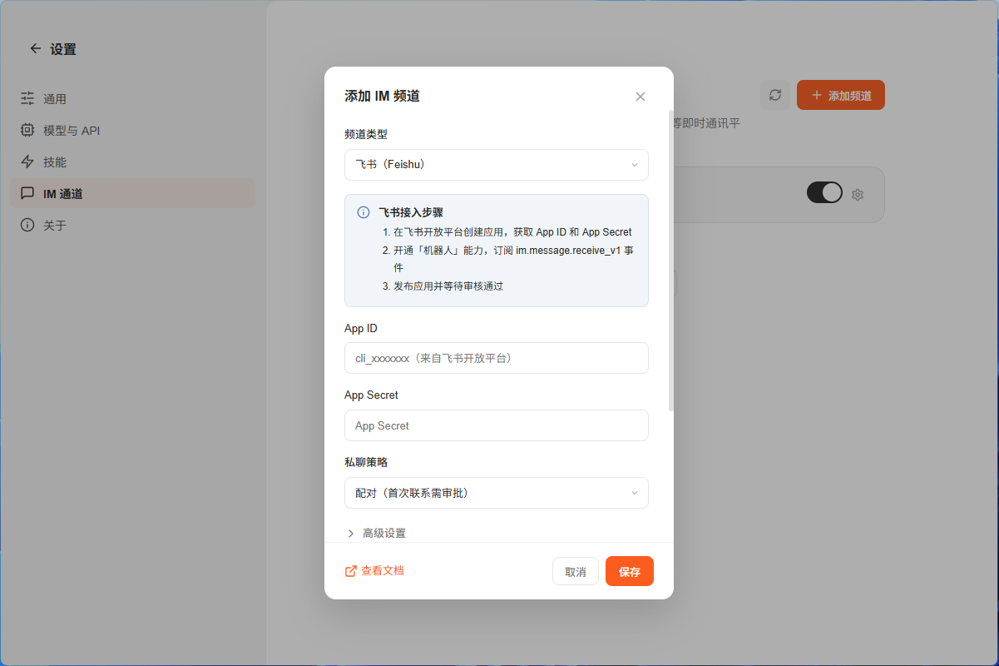

<p align="center">
  
</p>

<h1 align="center">AivoClaw</h1>

<p align="center">
  <strong>The GUI Desktop Client for OpenClaw</strong><br/>
  Ditch the terminal. Embrace the desktop. All the power of <a href="https://github.com/openclaw/openclaw">OpenClaw</a> in a single installer.
</p>

<p align="center">
  <a href="https://aivoclaw.com"></a>
  <a href="https://github.com/yuanyuekejiJN/AivoClaw/releases/latest"></a>
  <a href="https://github.com/yuanyuekejiJN/AivoClaw/releases"></a>
  <a href="https://github.com/yuanyuekejiJN/AivoClaw/blob/main/LICENSE"></a>
</p>

<p align="center">
  <a href="https://aivoclaw.com">🌍 Website</a> | English | <a href="./README.md">中文</a>
</p>

---

### 🦞 What problem does AivoClaw solve?

> **You shouldn't need a dev environment just to use an AI tool.**
> Install → paste your key → get to work. Three steps, no technical background needed.

[OpenClaw](https://github.com/openclaw/openclaw) is the fastest-growing open-source AI agent on GitHub in 2026, but it requires Node.js 22+, CLI operations, and manual configuration — too much friction for everyday users.

AivoClaw removes that friction entirely: we bundle the Node.js runtime and OpenClaw Gateway into a single installer. Double-click and you're ready.

**In short: you describe the task, AI handles the rest.**

🌍 [AivoClaw Website](https://aivoclaw.com)

| Capability | Details |
|---|---|
| 📦 **One-Click Install** | Double-click the installer and you're done — no CLI, no setup wizard, beginner-friendly |
| 🎨 **Beautiful UI** | Modern, polished interface with smooth interactions — no more staring at a terminal |
| ⚡ **Instant Launch** | From install to first conversation in under a minute |
| 🖥️ **Full Platform Support** | macOS (Apple Silicon / Intel) + Windows (x64 / ARM64) |
| 🔒 **Privacy First** | All credentials stay on your machine — nothing leaves your device |
| 🔄 **Visual Model Config** | Configure and switch AI models through a clean GUI — no config files to edit. Supports Anthropic / OpenAI / Google / Kimi and custom models |
| 🔼 **Silent Updates** | In-app update mechanism pushes new versions automatically |
| 🔗 **OpenClaw Compatible** | Fully compatible with OpenClaw config files and workspace data — zero data loss |
| 🔄 **Synced with Upstream** | Stays in sync with official OpenClaw releases — get bug fixes and new features as soon as they land |
| 🧠 **Context Persistence** | Chat history is saved locally and restored seamlessly across sessions |
| 🌐 **Live Search** | Kimi Search integration gives AI real-time web access |
| 👥 **Team Collaboration** | Connect to Feishu bots so your whole team can share one AI assistant |
| 🛡️ **Smart Detection** | Automatically checks for port conflicts and existing installations on startup |
| 💻 **CLI Available** | Registers `aivoclaw` to your system PATH for terminal-based workflows |
| 🚀 **Launch at Login** | Toggle launch-at-login from the Settings UI with a single click — no manual system config needed |
| 🇨🇳 **China Network Ready** | Ships with mirror configurations for reliable connectivity in mainland China |

### 🎨 Beautiful UI

> **Not just functional — beautiful.** Switch freely between dark and light themes, with smooth interactions and a polished look that makes your AI tool a pleasure to use.

<p align="center">
  
</p>

<p align="center">
  
</p>

<p align="center">
  
</p>

### 🧩 Skill Ecosystem: Ready to Use, Endlessly Extensible

> **No more command-line operations — browse, install, and configure all skills through a visual interface.**

| | Highlight | Description |
|---|---|---|
| 📦 | **50+ Built-in Skills** | Pre-installed skills covering coding, docs, data processing, and more — ready out of the box |
| 🏪 | **12,000+ Store Skills** | Access a massive community skill store — one-click search and instant install, growing every day |
| 🖱️ | **Visual Install & Config** | Graphical skill management UI — browse, search, install, and configure entirely with your mouse, zero learning curve |

<p align="center">
  
</p>

### 📦 Get the Installer

Visit the [Releases page](https://github.com/yuanyuekejiJN/AivoClaw/releases/latest) and download for your platform:

| Platform | Architecture | File |
|---|---|---|
| 🍎 macOS | Apple Silicon (M1/M2/M3/M4) | `AivoClaw-x.x.x-arm64.dmg` |
| 🍎 macOS | Intel | `AivoClaw-x.x.x-x64.dmg` |
| 🪟 Windows | x64 | `AivoClaw-Setup-x.x.x-x64.exe` |
| 🪟 Windows | ARM64 | `AivoClaw-Setup-x.x.x-arm64.exe` |

> **How to choose?** M-series Mac → arm64, older Intel Mac → x64, most Windows machines → x64.

### 🚀 Quick Start

```
1.  Run the installer (macOS: drag to Applications / Windows: follow the wizard)
2.  Pick your AI provider and paste your API Key
3.  Type your first instruction and go
```

No Node.js, no npm, no dev dependencies required.

### 🤖 Supported LLMs

> **Fully visual configuration — no config files to edit.** Pick a provider, paste your API Key in the GUI, and switch models instantly.

**🌏 International LLMs**
- Anthropic (Claude)
- OpenAI (GPT / Codex)
- Google (Gemini)

**🇨🇳 China LLMs**
- Moonshot / Kimi (Kimi Code)
- DeepSeek
- Zhipu AI (GLM)
- Baidu Wenxin (ERNIE)
- Alibaba Tongyi (Qwen)
- MiniMax

**🔧 Custom**
- Any OpenAI / Anthropic-compatible third-party LLM — just fill in the Base URL through the GUI

<p align="center">
  
</p>

### 💬 Chat Integrations

AivoClaw comes with built-in multi-platform chat channel plugins. Toggle-based setup — no coding required to connect AI to your favorite messaging apps:

- **Feishu (Lark)** — Connect to Feishu group chats for direct AI conversations
- **WeCom** — Integrate with WeCom apps for seamless team collaboration
- **DingTalk** — Hook into DingTalk bots, invoke AI anytime in work groups
- **KimiClaw** — Built-in Kimi chat channel integration
- **QQ** — QQ bot support for community and social scenarios

> All channels support both private and group chat modes, toggled on with a single click in Settings.

<p align="center">
  
</p>

### 💡 What can you do with it?

- "Scrape all articles from this website and organize them into a spreadsheet"
- "Read these 10 webpages and generate a comparison report"
- "Batch-format this data according to my template"

You set the goal. AivoClaw delivers.

### 🏗️ Technical Architecture

```
AivoClaw (Electron)
  ├── Gateway process    (embedded Node.js 22 + OpenClaw runtime)
  └── Frontend UI        (Lit 3 single-page app, loaded via file:// protocol)
```

### ❓ FAQ

**Q: Do I need any programming knowledge?**
A: Not at all. AivoClaw is built to make AI tools accessible to everyone.

**Q: Do I have to install Node.js or other dev tools first?**
A: No — everything is bundled inside the app.

**Q: Can I switch AI providers after the initial setup?**
A: Anytime. Open "Settings" from the system tray menu (or press `Cmd+,` on macOS).

**Q: How does the Feishu integration work?**
A: Once you configure a Feishu Webhook, AivoClaw acts as a smart assistant in your Feishu workspace, responding to commands directly in group chats.

---

## 💬 Community

Scan the QR code to join the AivoClaw community group for updates, feedback, and discussions:

<p align="center">
  
</p>

---

## 🙏 Acknowledgements

AivoClaw is built on top of these excellent open-source projects. Thanks to the community:

- [OpenClaw](https://github.com/openclaw/openclaw) — Local-first open-source AI agent platform, the core runtime behind AivoClaw
- [Electron](https://www.electronjs.org/) — Cross-platform desktop application framework
- [Lit](https://lit.dev/) — Lightweight Web Components framework
- [Node.js](https://nodejs.org/) — JavaScript runtime

---

## ⭐ Star History

<a href="https://www.star-history.com/?repos=yuanyuekejiJN%2FAivoClaw&type=date&legend=top-left">
 <picture>
   <source media="(prefers-color-scheme: dark)" srcset="https://api.star-history.com/image?repos=yuanyuekejiJN/AivoClaw&type=date&theme=dark&legend=top-left" />
   <source media="(prefers-color-scheme: light)" srcset="https://api.star-history.com/image?repos=yuanyuekejiJN/AivoClaw&type=date&legend=top-left" />
   
 </picture>
</a>

---

## 📄 License

GNU Affero General Public License v3.0 (`AGPL-3.0-only`).

Commercial use is permitted. If you modify and distribute this software — or serve a modified version over a network — you must release the corresponding source code under AGPL v3.

---

<p align="center">
  <sub>Built by <a href="https://aivoclaw.com">Yuanyue Technology</a></sub>
</p>
